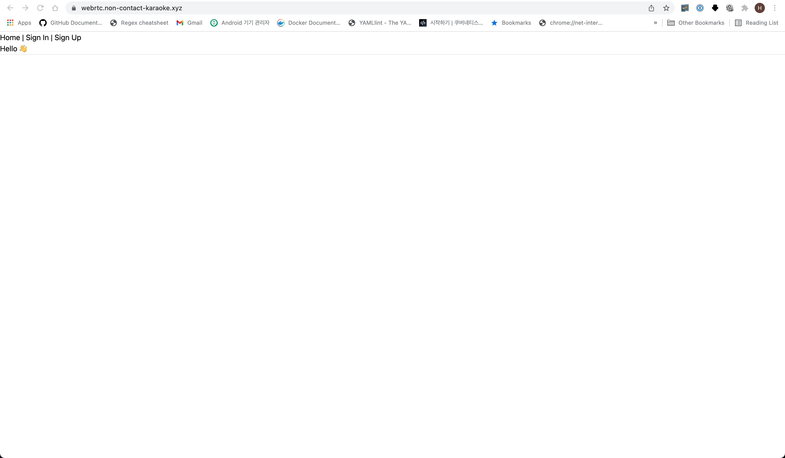
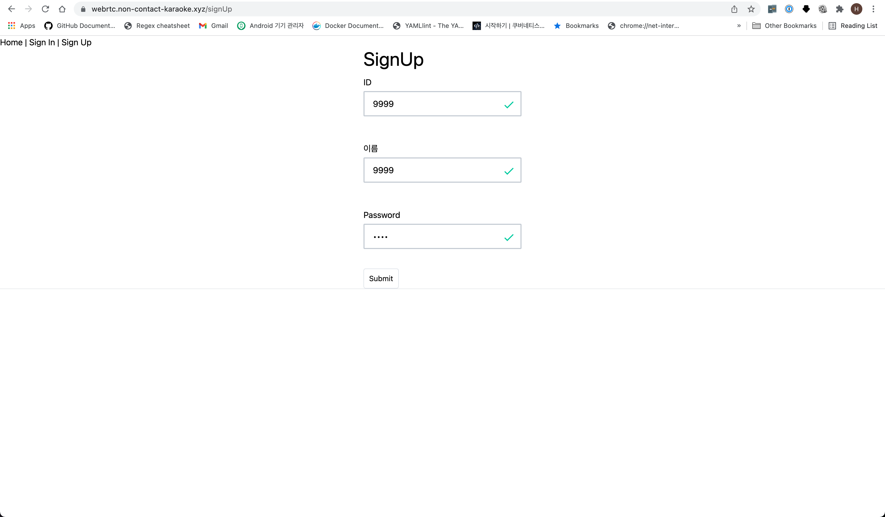
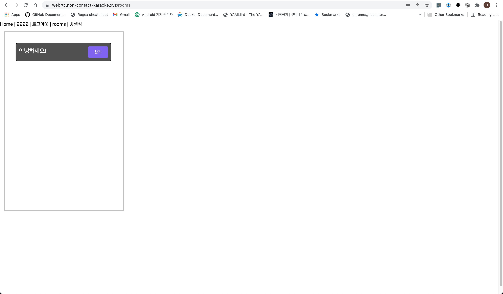

# Non-contact-karaoke

## 1. Purpose

본 프로젝트는 webrtc를 이용하여 간단히 비디오 peer간 비디오 스트림을 전송하는 것을 주요 목표로 하고 있습니다.

이를 위해 소켓, 회원 관리를 위한 api, ui로 파트를 나누어 작업하였습니다.

TODO로서는 데이터 채널을 이용하여 음원 및 채팅을 주고 받는 것을 목표로 합니다.

## 2. How to run

```
docker-compose build && docker-compose up -d

```

or

```
    cd cmd/db/
    docker-compose build && docker-compose up -d
    cd ../..
    ./ run-dev.sh
```

## 3. Demo






## 4. Dependancy

본 프로젝트는 2021년 12월 기준 최신 버전의 `NodeJs`기반으로 구동되며, 구조가 크게 `apid`, `socketd`, `webd`으로 나누어집니다.

- `apid`는 http 메소드를 이용하여 간단히 로그인 및 회원가입처리를 합니다. 이를 위해 DB연결을 하는 DAO와 controller를 이용하며 왠만하면 restful하게 작성하였습니다.
- `socketd`은 socket통신을 구현하며 본 프로젝트의 주요 목표인 비디오 스트림을 위해 ICEcandidate를 하는 과정, 즉 webrtc 위한 프로세스를 담고 있습니다.
- `webd`은 `ui`디렉터리에 있는 react를 static으로 변환 후 서브하는 처리를 합니다.
